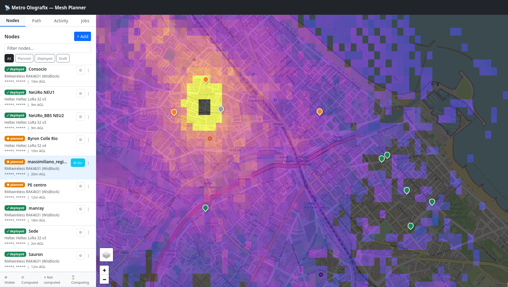
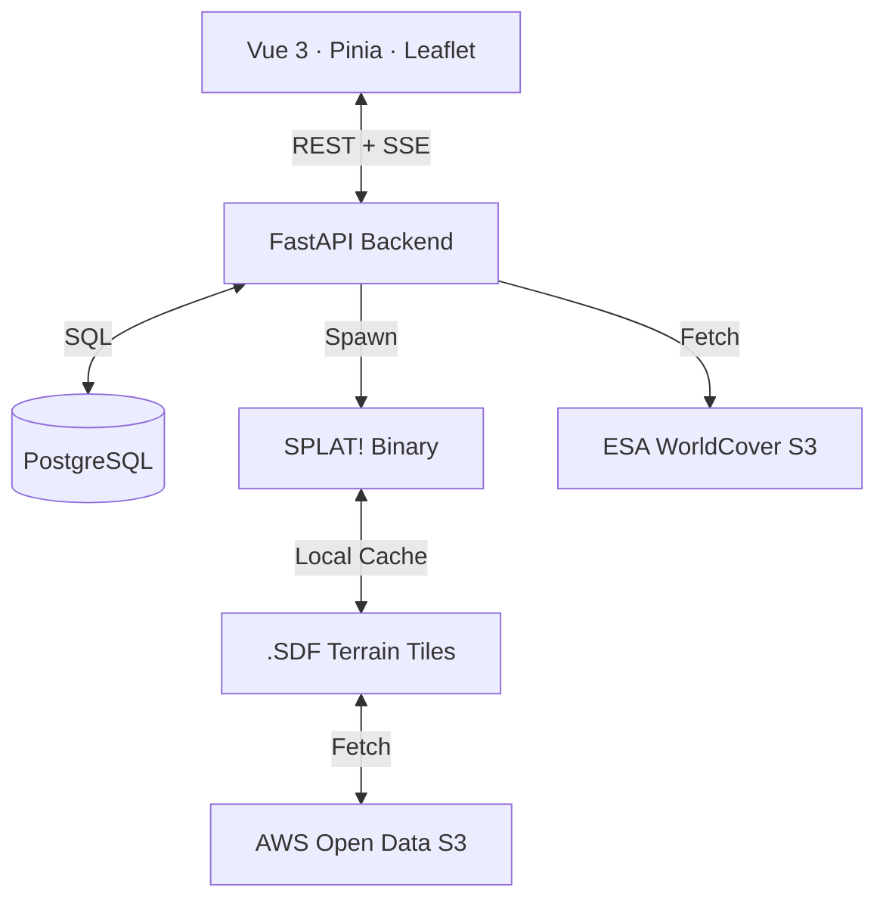
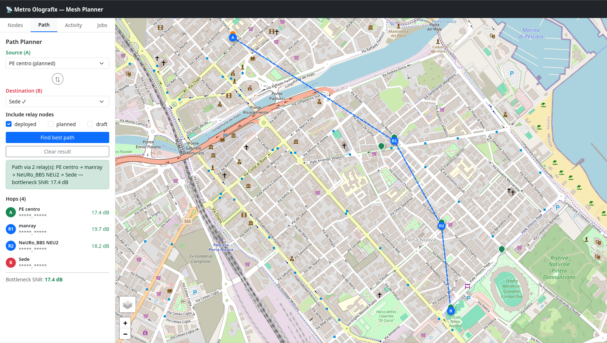

# Metro Olografix — Mesh Planner

A professional, collaborative **Meshtastic node deployment planner** for the Metro Olografix association. Combines high-fidelity RF propagation modeling with real-time collaboration to build a resilient communication mesh in Abruzzo, Italy.



## 🚀 Key Features

| Feature | Description |
|---|---|
| **🧪 Coverage Tester** | Public `/try` wizard — anyone can simulate node coverage without signing up. No data stored. |
| **📡 Node Management** | Add, edit, and delete nodes with granular control over RF parameters, height, and equipment. |
| **📈 Deployment Workflow** | Lifecycle management for nodes: `Draft` (private), `Planned`, and `Deployed`. |
| **🌍 RF Propagation** | Per-node **SPLAT!** simulations (ITM model) rendered as GeoTIFF overlays. |
| **🏙️ Auto-Clutter** | **ESA WorldCover 2021** (10 m) land-cover data for automatic obstacle height estimation. |
| **🛣️ Max-SNR Pathfinder** | A→B routing that maximises the bottleneck SNR across the best possible relay hops. |
| **🔄 Collaboration** | Live **Activity Feed** and instant **SSE** synchronisation for all connected members. |
| **🛡️ Auth & Privacy** | OIDC/OAuth2 with PKCE (any provider). Optional public read-only view with coordinate fuzzing. |
| **⚙️ Job Queue** | Asynchronous rendering with progress tracking and one-click global recompute. |

---

## 🛠️ Local Development

**Requirements:** Docker, Docker Compose v2, an OIDC-compliant identity provider.

```bash
cp .env.example .env
# Fill in OIDC_ISSUER, OIDC_CLIENT_ID, POSTGRES_PASSWORD
docker compose up
```

- Frontend (Vite + HMR): `http://localhost:5173`
- Backend API: `http://localhost:8000`

The compose file builds the backend from source and runs the frontend with the Vite dev server. It is **not intended for production** — use the Helm chart below.

---

## ☸️ Production Deployment (Kubernetes / Helm)

Pre-built images are published to GHCR on every push to `main`:
- `ghcr.io/metro-olografix/mesh-planner-backend:latest`
- `ghcr.io/metro-olografix/mesh-planner-frontend:latest`

The Helm chart in `hack/helm/mesh-planner/` deploys the backend, frontend, PostgreSQL, and an nginx Ingress in a single namespace.

**Requirements:** Kubernetes 1.24+, Helm 3.10+, nginx Ingress controller, cert-manager (optional, for TLS).

### 1. Create a values override file

```yaml
# my-values.yaml
postgresql:
  auth:
    password: "your-strong-password"    # required

zitadel:
  domain: https://auth.example.com      # required — OIDC issuer base URL
  clientId: "your-oidc-client-id"       # required

ingress:
  host: mesh.example.com                # required — public hostname
  tls:
    enabled: true
    certManager:
      enabled: true
      clusterIssuer: letsencrypt-prod
```

The images default to `ghcr.io/metro-olografix/mesh-planner-*:latest` — no override needed unless self-hosting images.

### 2. Install

```bash
helm install mesh-planner hack/helm/mesh-planner \
  --namespace mesh-planner --create-namespace \
  --values my-values.yaml
```

### 3. Upgrade

```bash
helm upgrade mesh-planner hack/helm/mesh-planner \
  --namespace mesh-planner \
  --values my-values.yaml
```

### Key chart values

| Value | Default | Description |
|---|---|---|
| `backend.storage.splatTiles.size` | `10Gi` | Terrain tile cache PVC size |
| `backend.storage.customAssets.enabled` | `false` | Enable PVC for custom logo/favicon |
| `ingress.className` | `nginx` | Ingress class name |
| `publicAccess.enabled` | `false` | Unauthenticated read-only mode |
| `logLevel` | `INFO` | Backend log verbosity |

> The Ingress is pre-configured with `proxy-buffering: off` and extended timeouts — both required for the SSE stream on `/api/events`.

<details>
<summary>Using a private registry or pinned image tag</summary>

```yaml
# my-values.yaml (additional fields)
imagePullSecrets:
  - name: regcred

backend:
  image:
    registry: your-registry.example.com
    repository: your-org/mesh-planner-backend
    tag: "abc1234"

frontend:
  image:
    registry: your-registry.example.com
    repository: your-org/mesh-planner-frontend
    tag: "abc1234"
```

Create the pull secret beforehand:
```bash
kubectl create secret docker-registry regcred \
  --namespace mesh-planner \
  --docker-server=your-registry.example.com \
  --docker-username=<user> \
  --docker-password=<token>
```

</details>

---

<details>
<summary>🔐 Authentication</summary>

Authentication uses the **OpenID Connect (OIDC) Authorization Code + PKCE** flow and works with any standards-compliant identity provider.

### Setting up your IdP

Create a **Single Page Application** (public client) in your IdP with:
- **Redirect URI**: `https://your-domain/callback`
- **Post-logout redirect URI**: `https://your-domain/`
- **Grant type**: Authorization Code
- **Scopes**: `openid profile email`

No client secret is needed (PKCE public client).

### Zitadel-specific notes
Zitadel places a project resource ID in the JWT `aud` claim rather than the OAuth client ID. Leave `OIDC_AUDIENCE` empty — the backend skips audience verification in this case, relying on signature + issuer + expiry checks instead.

For all other providers (Auth0, Okta, Keycloak), set `OIDC_AUDIENCE` to your API audience or client ID as required by the provider.

</details>

---

<details>
<summary>🌐 Public Read-Only Mode</summary>

When `PUBLIC_ACCESS=true`, unauthenticated visitors can view the map without logging in.

| What they see | What is hidden |
|---|---|
| Node names, statuses, hardware type | Exact coordinates (fuzzed ±500 m) |
| Live SSE updates | Notes, creator identity |
| Activity feed (node names and authors anonymised) | Coverage GeoTIFF overlays |
| — | Coverage job status |
| — | Jobs tab |
| — | Path planner |

Coordinates are fuzzed **server-side** using a deterministic algorithm (djb2 hash of the node ID), so the real position is never transmitted to unauthenticated clients. The same algorithm is used client-side for the authenticated privacy-mode toggle.

</details>

---

<details>
<summary>🧪 Coverage Tester (/try)</summary>

The `/try` page lets anyone — no account required — simulate LoRa node coverage in a guided 4-step wizard.

| Step | What happens |
|---|---|
| **1. Location** | Click the map to drop a pin anywhere in the world. |
| **2. Device** | Pick from the full hardware catalogue. Recommended devices are highlighted. |
| **3. Setup** | Set antenna height, surrounding environment, and a Fast / Balanced / Long Range preset. |
| **4. Results** | A SPLAT! simulation runs server-side (~10–15 s) and the coverage overlay is displayed. |

Results include a **shareable link** that encodes all settings as URL query parameters — opening it re-runs the simulation automatically.

### Endpoint details

`POST /api/try/simulate` — fully public, no authentication.

| Constraint | Default | Env variable |
|---|---|---|
| Max radius | 3 km | `TRY_MAX_RADIUS_KM` |
| Resolution | Standard (90 m / 3-arcsecond) | — |
| Persistence | None — GeoTIFF returned directly | — |
| Rate limit | 6 / IP / hour | `TRY_RATE_LIMIT_PER_HOUR` |
| Concurrency | 2 simultaneous SPLAT! processes | `TRY_MAX_CONCURRENT` |

> Rate limiting is in-process. For multi-instance deployments, replace the in-memory counter with a shared Redis store.

</details>

---

<details>
<summary>🎨 Custom Branding</summary>

Drop files into the `custom/` directory at the project root to override the default logo and favicon. No rebuild required.

| File | Description |
|---|---|
| `custom/logo.png` (or `.svg`, `.webp`, `.jpg`) | Replaces the 📡 emoji in the navbar |
| `custom/favicon.ico` (or `.png`, `.svg`) | Replaces the browser tab icon |

**Docker Compose:** the `custom/` directory is bind-mounted read-only into the backend container. Replace the files and restart the backend to apply changes.

**Kubernetes:** enable the custom assets PVC in your values file, then copy assets into the pod:
```yaml
backend:
  storage:
    customAssets:
      enabled: true
      size: 50Mi
```
```bash
kubectl cp custom/ mesh-planner/<backend-pod>:/app/custom/
```

</details>

---

<details>
<summary>⚙️ Configuration Reference</summary>

All settings are read from `.env` (Docker Compose) or environment variables injected by Helm.

| Variable | Required | Description |
|---|---|---|
| `POSTGRES_PASSWORD` | ✅ | PostgreSQL database password |
| `OIDC_ISSUER` | ✅ | OIDC provider base URL, e.g. `https://auth.example.com` (no trailing slash) |
| `OIDC_CLIENT_ID` | ✅ | OAuth client ID of the SPA application |
| `OIDC_AUDIENCE` | — | Enforce `aud` claim verification (leave empty for Zitadel) |
| `PUBLIC_ACCESS` | — | `true` to allow unauthenticated read-only access (default: `false`) |
| `CORS_ORIGINS` | — | Comma-separated allowed origins (default: `http://localhost:5173`) |
| `LOG_LEVEL` | — | `DEBUG` / `INFO` / `WARNING` / `ERROR` (default: `INFO`) |
| `SPLAT_PATH` | — | Path to SPLAT! binaries (default: `/app`) |
| `TILE_CACHE_DIR` | — | Terrain tile cache directory (default: `/app/.splat_tiles`) |
| `TILE_CACHE_GB` | — | Maximum terrain tile cache size in GB (default: `2.0`) |
| `TRY_RATE_LIMIT_PER_HOUR` | — | Max `/try` simulations per IP per hour (default: `6`) |
| `TRY_MAX_RADIUS_KM` | — | Coverage radius cap for `/try` simulations in km (default: `3.0`) |
| `TRY_MAX_CONCURRENT` | — | Max simultaneous SPLAT! processes on `/try` (default: `2`) |

</details>

---

<details>
<summary>🏗️ Architecture & How It Works</summary>





### Deployment Lifecycle & Privacy
1. **Draft**: Private to the creator. Experiment with locations without cluttering the map.
2. **Planned**: Shared with all members. Used for proposing new node sites and coordinating hardware.
3. **Deployed**: Marked as live. These nodes are used by the Path Planner as potential mesh relays.

### RF Propagation Model (SPLAT! + ITM)
Uses the **Irregular Terrain Model (ITM / Longley-Rice)** — path loss over irregular terrain, accounting for diffraction, ground reflections, and atmospheric bending.
- **Model**: `olditm` (Standard ITM, preferred for Meshtastic frequencies).
- **Auto-Invalidation**: If any RF-relevant field (lat, lon, hardware, antenna height, etc.) changes, the coverage cache is automatically marked stale and requires a re-run.

### Intelligent Clutter Modeling
When a node's environment is set to `auto`, the backend queries **ESA WorldCover 2021** Cloud-Optimized GeoTIFFs on S3, sampling the 10 m land-cover class and applying realistic ground clutter offsets.

### Path Planning Algorithm
Finds the path where the **worst-case SNR** among all hops is as high as possible:
- **Bidirectional Validation**: For every hop A→B, checks that B can also reach A.
- **Dijkstra Optimization**: Maximises the bottleneck link quality.
- **Friis Penalty**: Free-space hops (no SPLAT data) receive a **15 dB penalty** to prefer terrain-verified paths.

</details>

---

<details>
<summary>🗃️ Database Migrations</summary>

Schema changes are managed with **Alembic**. Migrations run automatically on startup (`alembic upgrade head`).

**Create a new migration** after modifying SQLAlchemy models:
```bash
docker compose exec backend alembic revision --autogenerate -m "description"
```

**Inspect migrations:**
```bash
docker compose exec backend alembic upgrade head   # apply all pending
docker compose exec backend alembic current        # show current revision
docker compose exec backend alembic history        # list all revisions
```

**Existing deployments** upgrading from a pre-Alembic version should stamp the database first:
```bash
docker compose exec backend alembic stamp head
```

On Kubernetes:
```bash
kubectl exec -n mesh-planner deploy/mesh-planner-backend -- alembic upgrade head
```

</details>

---

<details>
<summary>🔄 CI/CD</summary>

A GitHub Actions pipeline (`.github/workflows/ci.yml`) runs on every push and pull request to `main`:

| Job | Trigger | Description |
|---|---|---|
| **lint** | push + PR | `ruff check` and `ruff format --check` on `backend/` |
| **test** | push + PR | `pytest` against a PostgreSQL service container |
| **docker-build** | PR only | Validates both Dockerfiles build successfully |
| **docker-publish** | push to `main` | Builds and pushes images to GHCR |

Published images:
- `ghcr.io/metro-olografix/mesh-planner-backend:<sha>` / `:latest`
- `ghcr.io/metro-olografix/mesh-planner-frontend:<sha>` / `:latest`

</details>

---

<details>
<summary>📻 LoRa Presets & Hardware</summary>

The planner calculates the thermal noise floor as: `−174 dBm + 10·log₁₀(BW_Hz) + NF_dB`.

| Preset | SF | BW (kHz) | Floor (dBm) | Min SNR (dB) |
|---|---|---|---|---|
| SHORT_FAST | 7 | 500 | −114 | -7.5 |
| SHORT_SLOW | 8 | 250 | −120 | -10.0 |
| **MEDIUM_FAST** | **9** | **250** | **−121** | **-12.5** |
| MEDIUM_SLOW | 10 | 250 | −121 | -15.0 |
| LONG_FAST | 11 | 250 | −121 | -17.5 |
| LONG_SLOW | 12 | 125 | −124 | -20.0 |
| VERY_LONG_SLOW | 12 | 125 | −124 | -20.0 |

The hardware database contains optimised parameters for over **28 devices**, including **LilyGo** (T-Beam, T-Echo, T-Deck), **Heltec**, **RAKwireless**, and **Seeed Studio**. Custom antenna gains can be set per-node to override hardware defaults.

</details>
