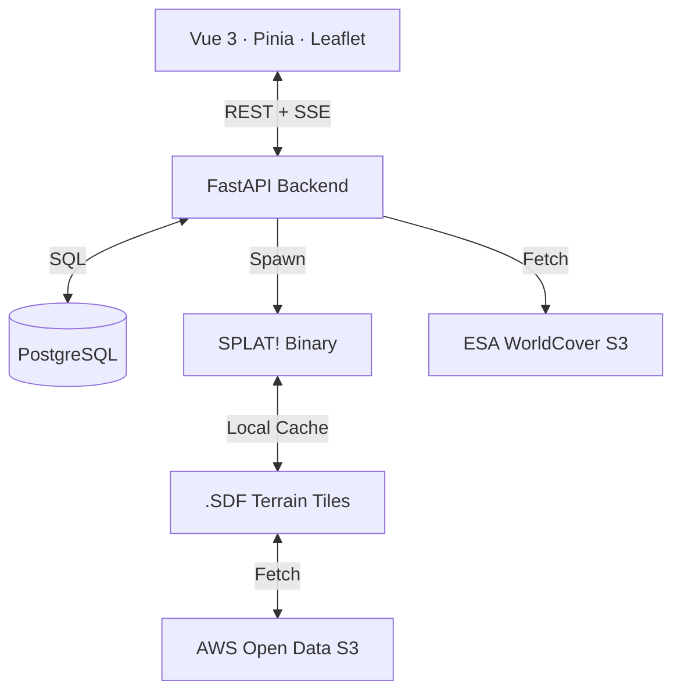

# Metro Olografix — Mesh Planner

A professional, collaborative **Meshtastic node deployment planner** for the Metro Olografix association. This tool combines high-fidelity RF propagation modeling with real-time collaboration to build the ultimate resilient communication mesh in Abruzzo, Italy.


## 🚀 Key Features

| Feature | Description |
|---|---|
| **📡 Node Management** | Add, edit, and delete nodes with granular control over RF parameters, height, and equipment. |
| **📈 Deployment Workflow** | Lifecycle management for nodes: `Draft` (private), `Planned`, and `Deployed`. |
| **🌍 RF Propagation** | Per-node **SPLAT!** simulations (ITM model) rendered as GeoTIFF overlays. |
| **🏙️ Auto-Clutter** | Industry-standard **ESA WorldCover 2021** (10m) land-cover data for automatic obstacle height estimation. |
| **🛣️ Max-SNR Pathfinder** | Intelligent A→B routing that maximizes the bottleneck SNR across the best possible relay hops. |
| **🔄 Collaboration** | Live **Activity Feed** and instant **SSE** synchronization for all connected members. |
| **🛡️ Auth & Privacy** | OIDC/OAuth2 with PKCE (any provider). Optional public read-only view with coordinate fuzzing. |
| **⚙️ Job Queue** | Asynchronous rendering system with progress tracking and one-click global recomputes. |

---

## 🛠️ How It Works

### Deployment Lifecycle & Privacy
Nodes follow a three-stage lifecycle to reflect real-world deployments:
1. **Draft**: Private to the creator. Use this to experiment with locations without cluttering the map for other association members.
2. **Planned**: Shared with all members. Used for proposing new node sites and coordinating hardware.
3. **Deployed**: Marked as live (green). These nodes are used by the **Path Planner** as potential mesh relays.

### RF Propagation Model (SPLAT! + ITM)
The Mesh Planner uses the **Irregular Terrain Model (ITM / Longley-Rice)**. It models path loss over irregular terrain, accounting for diffraction, ground reflections, and atmospheric bending.
- **Model**: `olditm` (Standard ITM, preferred for Meshtastic frequencies).
- **Climate**: Configurable (e.g., *Continental Temperate* by default).
- **Auto-Invalidation**: If any RF-relevant field (lat, lon, hardware, antenna height, etc.) is changed, the coverage cache is automatically marked as **stale** and requires a re-run.

### Intelligent Clutter Modeling
1. When a node's environment is set to `auto`, the backend queries **ESA WorldCover 2021** Cloud-Optimized GeoTIFFs on S3.
2. It samples the 10m land-cover class (e.g., "Built-up", "Tree cover") and applies realistic ground clutter offsets.

### Path Planning Algorithm
Finds the path where the **worst-case SNR** among all hops is as high as possible:
- **Bidirectional Validation**: For every hop A→B, the pathfinder checks if B can *also* reach A.
- **Dijkstra Optimization**: Maximizes the bottleneck link quality.
- **Friis Penalty**: Free-space hops (no SPLAT data) receive a **15 dB penalty** to ensure the planner prefers terrain-verified paths.

---

## 🏗️ Architecture




---

## ⚡ Quick Start

### 1. Requirements
- **Docker** & **Docker Compose v2**
- An **OIDC-compliant identity provider** (Zitadel, Keycloak, Auth0, Okta, etc.)

### 2. Configuration
1. Clone the repository and copy the env file:
   ```bash
   cp .env.example .env
   ```
2. Edit `.env` and fill in the required values (see [Configuration Reference](#configuration-reference) below).

### 3. Launch

**Production** (built frontend served by nginx):
```bash
docker compose --profile prod up -d
```
- Frontend: `http://localhost:8080`
- Backend API: `http://localhost:8000`

**Development** (Vite dev server with HMR):
```bash
docker compose --profile dev up
```
- Frontend dev server with hot reload: `http://localhost:5173`
- Backend API: `http://localhost:8000`

---

## 🔐 Authentication

Authentication uses the **OpenID Connect (OIDC) Authorization Code + PKCE** flow and works with any standards-compliant identity provider.

### Setting up your IdP

Create a **Single Page Application** (public client) in your IdP with:
- **Redirect URI**: `https://your-domain/callback`
- **Post-logout redirect URI**: `https://your-domain/`
- **Grant type**: Authorization Code
- **Scopes**: `openid profile email`

No client secret is needed (PKCE public client).

### Zitadel-specific notes
Zitadel places a project resource ID in the JWT `aud` claim rather than the OAuth client ID. Leave `OIDC_AUDIENCE` empty — the backend skips audience verification in this case, relying on signature + issuer + expiry checks instead.

For all other providers (Auth0, Okta, Keycloak), set `OIDC_AUDIENCE` to your API audience or client ID as required by the provider.

---

## 🌐 Public Read-Only Mode

When `PUBLIC_ACCESS=true`, unauthenticated visitors can view the map without logging in:

| What they see | What is hidden |
|---|---|
| Node names, statuses, hardware type | Exact coordinates (fuzzed ±500 m) |
| Live SSE updates | Notes, creator identity |
| Activity feed (anonymised) | Coverage GeoTIFF overlays |
| — | Path planner |

Coordinates are fuzzed **server-side** using a deterministic algorithm (djb2 hash of the node ID), so the real position is never transmitted to unauthenticated clients. The same algorithm is used client-side for the authenticated privacy-mode toggle, so markers appear at the same fuzzed position in both cases.

Authenticated users retain full access regardless of this setting.

---

## 🎨 Custom Branding

Drop files into the `custom/` directory at the project root to override the default logo and favicon. No rebuild is required — the backend detects them at startup and serves them at runtime.

| File | Description |
|---|---|
| `custom/logo.png` (or `.svg`, `.webp`, `.jpg`) | Replaces the 📡 emoji in the navbar |
| `custom/favicon.ico` (or `.png`, `.svg`) | Replaces the browser tab icon |

The `custom/` directory is bind-mounted read-only into the backend container. To update assets, replace the files and restart the backend.

---

## ⚙️ Configuration Reference

All settings are read from `.env` (copied from `.env.example`).

| Variable | Required | Description |
|---|---|---|
| `POSTGRES_PASSWORD` | ✅ | PostgreSQL database password |
| `OIDC_ISSUER` | ✅ | OIDC provider base URL, e.g. `https://auth.example.com` (no trailing slash) |
| `OIDC_CLIENT_ID` | ✅ | OAuth client ID of the SPA application |
| `OIDC_AUDIENCE` | — | Enforce `aud` claim verification (leave empty for Zitadel) |
| `PUBLIC_ACCESS` | — | `true` to allow unauthenticated read-only access (default: `false`) |
| `LOG_LEVEL` | — | `DEBUG` / `INFO` / `WARNING` / `ERROR` (default: `INFO`) |
| `SPLAT_PATH` | — | Path to SPLAT! binaries (default: `/app`) |
| `TILE_CACHE_DIR` | — | Terrain tile cache directory (default: `/app/.splat_tiles`) |
| `TILE_CACHE_GB` | — | Maximum terrain tile cache size in GB (default: `2.0`) |

---

## 📻 LoRa Presets & Sensitivity

The planner calculates the thermal noise floor as: `−174 dBm + 10·log₁₀(BW_Hz) + NF_dB`.

| Preset | SF | BW (kHz) | Floor (dBm) | Min SNR (dB) |
|---|---|---|---|---|
| SHORT_FAST | 7 | 500 | −114 | -7.5 |
| SHORT_SLOW | 8 | 250 | −120 | -10.0 |
| **MEDIUM_FAST** | **9** | **250** | **−121** | **-12.5** |
| MEDIUM_SLOW | 10 | 250 | −121 | -15.0 |
| LONG_FAST | 11 | 250 | −121 | -17.5 |
| LONG_SLOW | 12 | 125 | −124 | -20.0 |

---

## 📜 Hardware Database
The database contains optimized parameters for over **28 devices**, including **LilyGo** (T-Beam, T-Echo, T-Deck), **Heltec**, **RAKwireless**, and **Seeed Studio**. Custom antenna gains can be set per-node to override hardware defaults.
