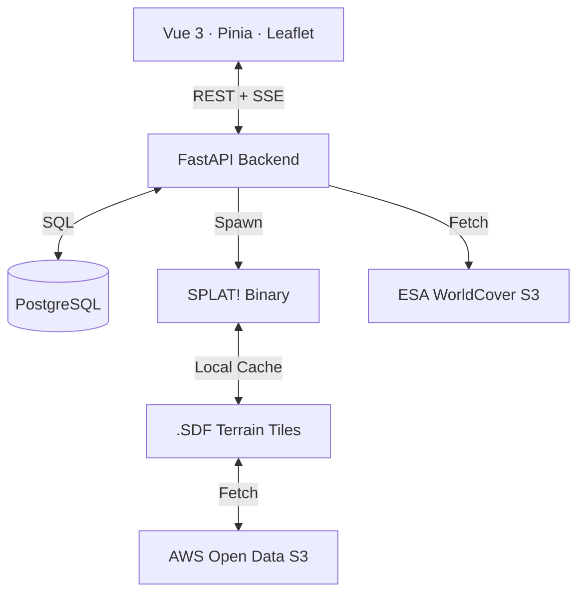

# Metro Olografix — Mesh Planner

A professional, collaborative **Meshtastic node deployment planner** for the Metro Olografix association. This tool combines high-fidelity RF propagation modeling with real-time collaboration to build the ultimate resilient communication mesh in Abruzzo, Italy.


## 🚀 Key Features

| Feature | Description |
|---|---|
| **📡 Node Management** | Add, edit, and delete nodes with granular control over RF parameters, height, and equipment. |
| **📈 Deployment Workflow** | Lifecycle management for nodes: `Draft` (private), `Planned`, and `Deployed`. |
| **🌍 RF Propagation** | Per-node **SPLAT!** simulations (ITM model) rendered as GeoTIFF overlays. |
| **🏙️ Auto-Clutter** | Industry-standard **ESA WorldCover 2021** (10m) land-cover data for automatic obstacle height estimation. |
| **🛣️ Max-SNR Pathfinder** | Intelligent A→B routing that maximizes the bottleneck SNR across the best possible relay hops. |
| **🔄 Collaboration** | Live **Activity Feed** and instant **SSE** synchronization for all connected members. |
| **🛡️ Privacy & Auth** | Zitadel OAuth2 integration. Draft nodes are only visible to the creator until made public. |
| **⚙️ Job Queue** | Asynchronous rendering system with progress tracking and one-click global recomputes. |

---

## 🛠️ How It Works

### Deployment Lifecycle & Privacy
Nodes follow a three-stage lifecycle to reflect real-world deployments:
1. **Draft**: Private to the creator. Use this to experiment with locations without cluttering the map for other association members.
2. **Planned**: Shared with all members. Used for proposing new node sites and coordinating hardware.
3. **Deployed**: Marked as live (green). These nodes are used by the **Path Planner** as potential mesh relays.

### RF Propagation Model (SPLAT! + ITM)
The Mesh Planner uses the **Irregular Terrain Model (ITM / Longley-Rice)**. It models path loss over irregular terrain, accounting for diffraction, ground reflections, and atmospheric bending.
- **Model**: `olditm` (Standard ITM, preferred for Meshtastic frequencies).
- **Climate**: Configurable (e.g., *Continental Temperate* by default).
- **Auto-Invalidation**: If any RF-relevant field (lat, lon, hardware, antenna height, etc.) is changed, the coverage cache is automatically marked as **stale** and requires a re-run.

### Intelligent Clutter Modeling
1. When a node's environment is set to `auto`, the backend queries **ESA WorldCover 2021** Cloud-Optimized GeoTIFFs on S3.
2. It samples the 10m land-cover class (e.g., "Built-up", "Tree cover") and applies realistic ground clutter offsets.

### Path Planning Algorithm
Finds the path where the **worst-case SNR** among all hops is as high as possible:
- **Bidirectional Validation**: For every hop A→B, the pathfinder checks if B can *also* reach A.
- **Dijkstra Optimization**: Maximizes the bottleneck link quality.
- **Friis Penalty**: Free-space hops (no SPLAT data) receive a **15 dB penalty** to ensure the planner prefers terrain-verified paths.

---

## 🏗️ Architecture




---

## ⚡ Quick Start

### 1. Requirements
- **Docker** & **Docker Compose v2**
- A **Zitadel** instance (configured for JWT tokens and PKCE)

### 2. Configuration
1. Clone the repository and copy the env file:
   ```bash
   cp .env.example .env
   ```
2. Configure your `ZITADEL_DOMAIN` and `ZITADEL_CLIENT_ID`.

### 3. Launch
```bash
docker compose up -d
```
- **Frontend**: Available at `http://localhost:8080`.
- **Backend API**: Exposed at `http://localhost:8000`.

---

## 📻 LoRa Presets & Sensitivity

The planner calculates the thermal noise floor as: `−174 dBm + 10·log₁₀(BW_Hz) + NF_dB`.

| Preset | SF | BW (kHz) | Floor (dBm) | Min SNR (dB) |
|---|---|---|---|---|
| SHORT_FAST | 7 | 500 | −114 | -7.5 |
| SHORT_SLOW | 8 | 250 | −120 | -10.0 |
| **MEDIUM_FAST** | **9** | **250** | **−121** | **-12.5** |
| MEDIUM_SLOW | 10 | 250 | −121 | -15.0 |
| LONG_FAST | 11 | 250 | −121 | -17.5 |
| LONG_SLOW | 12 | 125 | −124 | -20.0 |

---

## 📜 Hardware Database
The database contains optimized parameters for over **28 devices**, including **LilyGo** (T-Beam, T-Echo, T-Deck), **Heltec**, **RAKwireless**, and **Seeed Studio**. Custom antenna gains can be set per-node to override hardware defaults.
